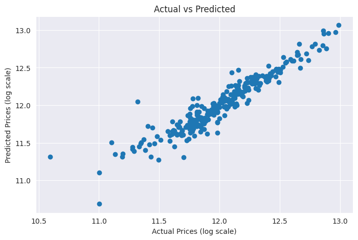
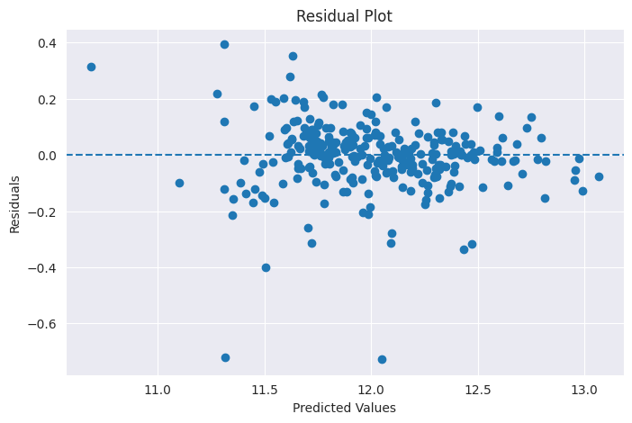

# House Price Prediction using Ames Housing Dataset

## Overview

This project predicts house sale prices using the Ames Housing Dataset. The objective was to build and compare multiple regression models and identify the most effective approach for predicting house prices.

The project covers the complete machine learning workflow including data cleaning, missing value treatment, outlier handling, feature engineering, encoding categorical variables, model training, evaluation, and feature importance analysis.

---

## Dataset

Dataset: Ames Housing Dataset

The dataset contains 1,460 residential properties and 80 explanatory variables describing various aspects of houses such as:

* Living area
* Overall quality
* Basement size
* Garage capacity
* Year built
* Neighborhood
* Sale condition

Target Variable:

* SalePrice

---

## Data Preprocessing

The following preprocessing steps were performed:

* Missing value handling
* Outlier detection and treatment
* Log transformation of SalePrice
* One-Hot Encoding for categorical variables
* Feature selection using correlation analysis
* Train-test split (80-20)

---

## Models Implemented

### Linear Regression

A baseline regression model used to establish initial performance.

### Ridge Regression

Regularized linear model used to reduce overfitting and handle multicollinearity.

### Lasso Regression

L1-regularized regression model used for feature selection and improved generalization.

### Random Forest Regressor

Ensemble tree-based model used for comparison against linear models.

---

## Model Performance

| Model             | R² Score | MAE     | RMSE    |
| ----------------- | -------- | ------- | ------- |
| Linear Regression | 0.88536  | 0.08554 | 0.12732 |
| Ridge Regression  | 0.88547  | 0.08544 | 0.12726 |
| Lasso Regression  | 0.89503  | 0.08101 | 0.12183 |
| Random Forest     | 0.86808  | 0.09070 | 0.13658 |

### Best Model

Lasso Regression achieved the best overall performance with:

* R² = 0.8950
* MAE = 0.0810
* RMSE = 0.1218

---

## Feature Importance

The most influential features identified by the Lasso model include:

* GrLivArea
* OverallQual
* YearBuilt
* TotalBsmtSF
* LotArea
* GarageCars
* Neighborhood-related features

---

## Visualizations

### Feature Importance

### Actual vs Predicted Prices

### Residual Plot

---

## Key Findings

* Living area (GrLivArea) is the strongest predictor of house price.
* Overall quality significantly impacts property value.
* Regularized models outperform basic Linear Regression.
* Lasso Regression provided the best balance between accuracy and generalization.

---

## Technologies Used

* Python
* Pandas
* NumPy
* Matplotlib
* Seaborn
* Scikit-learn
* Kaggle

---

## Kaggle Notebook

https://www.kaggle.com/code/srisairishita/house-price-prediction

---

## Future Improvements

* Hyperparameter tuning using GridSearchCV
* XGBoost implementation
* Streamlit deployment
* Advanced feature engineering
* Cross-validation optimization
